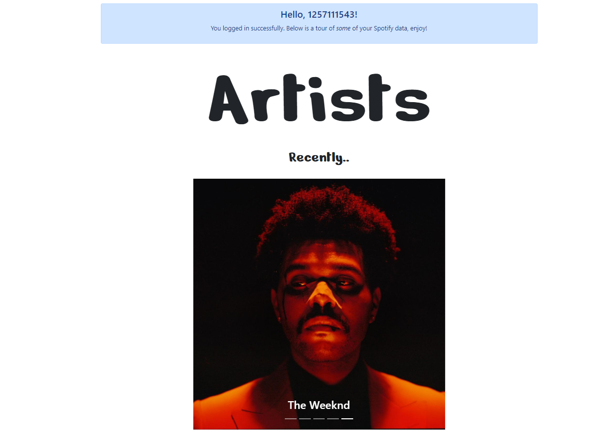
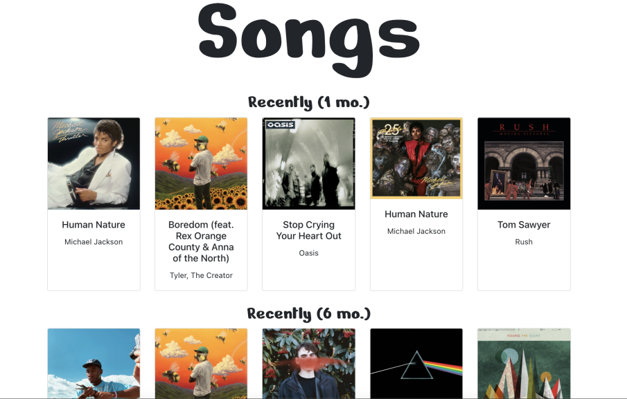
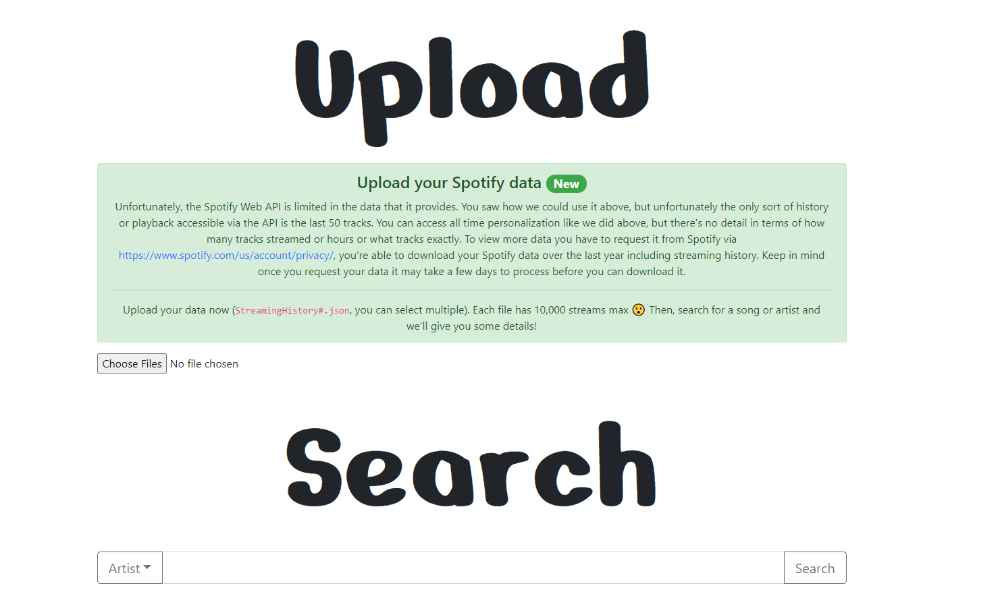
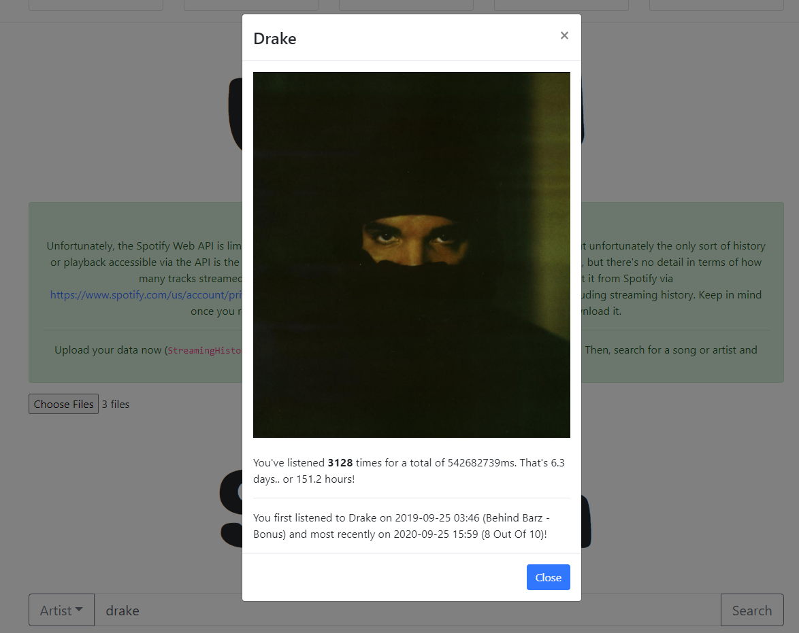
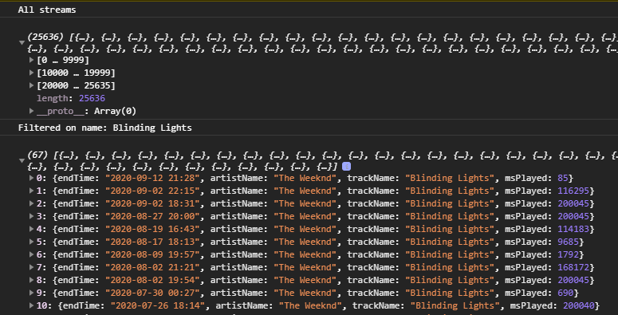
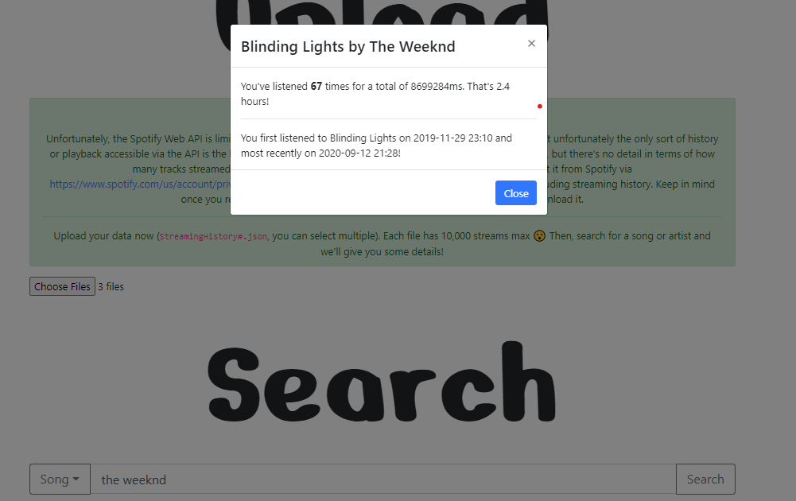

# Dataify

This project was built with `create-react-app` to display your recent favorite artists and tracks on Spotify. It also allows you to upload your streaming data if you download it from Spotify and search artists/tracks to get total time and dates listened (something the Spotify API doesn't offer).

## Screenshots

There is also an About page that talks about the project and data tracking from Spotify and in general. The project can be found at https://dataify.herokuapp.com/. Try it for yourself!  

---
## Technical Writeup  

I used the Fetch API (https://developer.mozilla.org/en-US/docs/Web/API/Fetch_API) to make requests with the user's access token. This access token was the authorization Spotify needed to retrieve the data that was requested. The access token was a Bearer token and was retrieved solely client-side using implicit grant flow from Spotify's OAuth. Learn more here: https://developer.spotify.com/documentation/general/guides/authorization-guide/#implicit-grant-flow.  

After the user logged in, I was able to retrieve the access token from the callback URL and make requests to the Spotify Web API (https://developer.spotify.com/documentation/web-api/reference-beta/). The Personalization API was used to get a 'User's Top Artists and Tracks' and then return a Carousel and Card Deck as seen in the screenshots for the front end. The query parameter `time_range` was optional but you can see I used it considering I have 1mo, 6mo, and all time stats. The values would correspond `short_term`, `medium_term`, and `long_term` respectfully. The Search API (https://developer.spotify.com/documentation/web-api/reference-beta/#category-search) and User Profile API (https://developer.spotify.com/documentation/web-api/reference-beta/#category-users-profile) were also used. The User Profile API was used to get the `display_name` to display a successful login as seen in the first screenshot at the very top. The Search API was used to get a track or artist and then, if the user uploaded StreamingHistory.json data, would analyze how much time and when the artist/track was listened to. This is shown in the last screenshot.. big Drake fan.  

Below is a little more on how that algorithm works:  
1) The user uploads streaming history file(s) **must** be named `StreamingHistory0.json`, `StreamingHistory1.json`, etc. 
2) The user selects either Artist or Song from the button drop down, and then searches for a query. Let's say the user chose Song and typed 'The Weeknd.'
3) Since the first result from Spotify for a Song and query is 'The Weeknd' is his song 'Blinding Lights,' the algorithm would sort through all the files and filter it into a new array of only Blinding Light streams.  
4) Render the information via a modal

The code to match track names was   
`
            var result = streamingDataArr.filter(obj => {
                return obj.trackName === name;
            }
`

and for artist names was similar  
`
  var result = streamingDataArr.filter(obj => {
                return obj.artistName === name;
            })
            `  
  
  Here's a picture that shows this in action  

  

My three files add up to `25636` streams! Once I have the subset of data that I need in this case, 67 Blinding Lights streams, then I could add up all the `msPlayed` as well as find the earliest and latest dates streamed using `endTime.`

To add up all the time played the following code was used:  
`result.reduce((a, b) => +a + +b.msPlayed, 0)`

Thanks, StackOverflow.

Then I opted to sort the array based on date, so I could take the first and last indices to find the lastest and earliest dates. This was done via  

` result.sort(function (a, b) {
            return new Date(b.endTime) - new Date(a.endTime);
        });
        `

And from there all I had to do was set some states for React to render my data, and Ta-Da!

If you don't have a copy of your data the Upload and Search sections are of no-use to you, but come back once you download it! A big inspiration for this part was how Apple showed how many hours you listened to a certain artist for their 2020 Replay, but the Spotify Wrapped didn't.. so I made my own but sadly it can't be done solely via the Spotify Web API.
